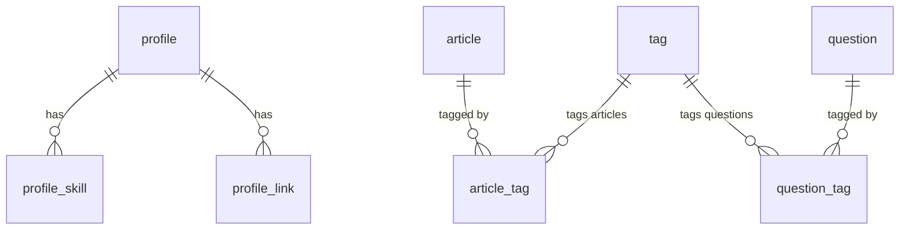

# CodeChronicles 数据库设计说明

## 总览

当前数据库用于个人技术博客首页和文章阅读入口，核心数据分为四类：

- 作者信息：`profile`、`profile_skill`、`profile_link`
- 内容信息：`article`
- 标签体系：`tag`、`article_tag`
- 问答扩展：`question`、`question_tag`

数据库名称：`codechronicles`

字符集：`utf8mb4`

排序规则：`utf8mb4_0900_ai_ci`

## 表关系

## 表说明

### profile

用途：存储博客作者的基础资料，用于首页顶部个人信息区。

| 字段 | 类型 | 必填 | 默认值 | 说明 |
| --- | --- | --- | --- | --- |
| id | bigint | 是 | 自增 | 个人资料主键 |
| nickname | varchar(64) | 是 | 无 | 作者昵称 |
| account | varchar(64) | 是 | 无 | 作者账号标识 |
| avatar | varchar(512) | 否 | null | 头像图片地址 |
| bio | varchar(512) | 否 | null | 个人简介 |
| role | varchar(128) | 否 | null | 职业或技术方向 |
| location | varchar(128) | 否 | null | 所在地 |
| followers | int | 是 | 0 | 关注者数量 |

关系：一条 `profile` 可对应多条 `profile_skill` 和 `profile_link`。

### profile_skill

用途：存储作者技术栈标签，例如 Java、Spring Boot、Vue。

| 字段 | 类型 | 必填 | 默认值 | 说明 |
| --- | --- | --- | --- | --- |
| id | bigint | 是 | 自增 | 个人技能主键 |
| profile_id | bigint | 是 | 无 | 所属个人资料ID |
| skill | varchar(64) | 是 | 无 | 技能名称 |
| sort_order | int | 是 | 0 | 展示排序，值越小越靠前 |

关系：`profile_skill.profile_id` 外键关联 `profile.id`。

### profile_link

用途：存储 GitHub、邮箱等外部链接。

| 字段 | 类型 | 必填 | 默认值 | 说明 |
| --- | --- | --- | --- | --- |
| id | bigint | 是 | 自增 | 个人链接主键 |
| profile_id | bigint | 是 | 无 | 所属个人资料ID |
| label | varchar(64) | 是 | 无 | 链接显示名称 |
| url | varchar(512) | 是 | 无 | 外部链接地址 |
| sort_order | int | 是 | 0 | 展示排序，值越小越靠前 |

关系：`profile_link.profile_id` 外键关联 `profile.id`。

### tag

用途：统一维护文章和问答使用的技术标签。

| 字段 | 类型 | 必填 | 默认值 | 说明 |
| --- | --- | --- | --- | --- |
| id | bigint | 是 | 自增 | 标签主键 |
| name | varchar(64) | 是 | 无 | 标签名称 |
| sort_order | int | 是 | 0 | 展示排序，值越小越靠前 |

约束：`name` 有唯一索引 `uk_tag_name`，避免重复标签。

### article

用途：存储博客文章列表和详情内容。

| 字段 | 类型 | 必填 | 默认值 | 说明 |
| --- | --- | --- | --- | --- |
| id | bigint | 是 | 自增 | 文章主键 |
| title | varchar(160) | 是 | 无 | 文章标题 |
| summary | varchar(512) | 是 | 无 | 文章摘要 |
| cover | varchar(512) | 否 | null | 文章封面图片地址 |
| category | varchar(64) | 是 | 无 | 文章分类名称 |
| content | text | 否 | null | 文章正文内容 |
| status | varchar(32) | 是 | PUBLISHED | 文章状态：PUBLISHED 已发布，DRAFT 草稿 |
| published_at | date | 是 | 后端生成 | 发布时间 |
| updated_at | date | 是 | 后端生成 | 最后更新时间 |
| views | int | 是 | 0 | 阅读量 |
| likes | int | 是 | 0 | 点赞数 |
| comments | int | 是 | 0 | 评论数 |

索引：`idx_article_status_published(status, published_at)` 用于按状态筛选并按发布时间排序。

关系：文章与标签是多对多关系，通过 `article_tag` 关联。

### article_tag

用途：维护文章与标签的多对多关系。

| 字段 | 类型 | 必填 | 默认值 | 说明 |
| --- | --- | --- | --- | --- |
| article_id | bigint | 是 | 无 | 文章ID |
| tag_id | bigint | 是 | 无 | 标签ID |

主键：联合主键 `(article_id, tag_id)`，防止同一文章重复绑定同一标签。

关系：

- `article_tag.article_id` 外键关联 `article.id`
- `article_tag.tag_id` 外键关联 `tag.id`

### question

用途：存储首页右侧问答精选内容。

| 字段 | 类型 | 必填 | 默认值 | 说明 |
| --- | --- | --- | --- | --- |
| id | bigint | 是 | 自增 | 问答主键 |
| title | varchar(160) | 是 | 无 | 问题标题 |
| description | varchar(512) | 是 | 无 | 问题描述或摘要 |
| answer_count | int | 是 | 0 | 回答数量 |
| updated_at | date | 是 | 无 | 最后更新时间 |

索引：`idx_question_updated_at(updated_at)` 用于按更新时间展示近期问答。

关系：问答与标签是多对多关系，通过 `question_tag` 关联。

### question_tag

用途：维护问答与标签的多对多关系。

| 字段 | 类型 | 必填 | 默认值 | 说明 |
| --- | --- | --- | --- | --- |
| question_id | bigint | 是 | 无 | 问答ID |
| tag_id | bigint | 是 | 无 | 标签ID |

主键：联合主键 `(question_id, tag_id)`，防止同一问答重复绑定同一标签。

关系：

- `question_tag.question_id` 外键关联 `question.id`
- `question_tag.tag_id` 外键关联 `tag.id`

## 设计说明

- 标签表复用在文章和问答中，避免文章标签、问答标签各建一套导致命名不一致。
- 文章和标签、问答和标签都使用关联表建模，支持一个内容绑定多个标签，也支持一个标签下有多个内容。
- `profile_skill` 和 `profile_link` 从 `profile` 拆出，便于按排序展示，也便于后续维护多个链接或技能。
- 文章的 `published_at`、`updated_at`、`views`、`likes`、`comments` 属于系统字段，创建文章时应由后端生成或维护，不建议前端手动编辑。
- 当前表结构服务于博客首页、文章列表、文章详情和问答精选。后续评论系统、后台管理、搜索和归档可以在此基础上扩展。
